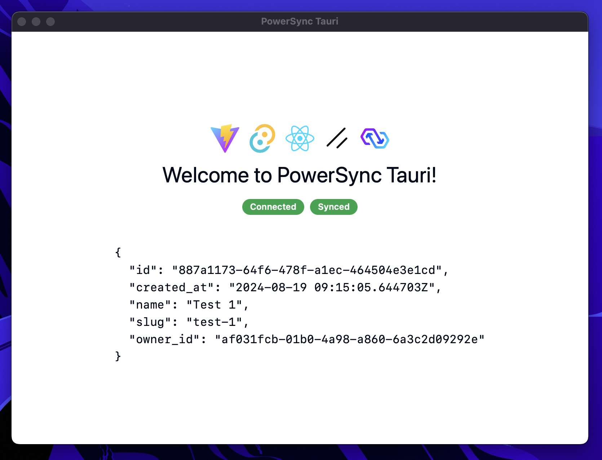

# Tauri + Shadcn UI + PowerSync

This template should help get you started developing with [Tauri](https://tauri.app), [React](https://reactjs.org), [Typescript](https://typescriptlang.org), [Shadcn UI](https://ui.shadcn.com) and [PowerSync](https://powersync.com) in [Vite](https://vitejs.dev).

In addition, this template also configures [ESLint](https://eslint.org/), [Prettier](https://prettier.io/), [Husky](https://typicode.github.io/husky/) and [Lint-staged](https://github.com/lint-staged/lint-staged) for pre-commits.



## Getting Started

### Basics

#### Install dependencies

```bash
pnpm install
```

#### Start the development server

```bash
pnpm run tauri dev
```

### PowerSync setup

This template is set up to work with PowerSync. PowerSync is a sync layer for building local-first apps with simple state management and real-time reactivity.

#### Environment variables

Copy the `.env.example` file to `.env` and fill in the required environment variables.

```bash
cp .env.example .env
```

Set `VITE_POWERSYNC_URL` and `VITE_POWERSYNC_TOKEN` to your PowerSync server URL and [development token](https://docs.powersync.com/usage/installation/authentication-setup/development-tokens) respectively.

#### Define your PowerSync schema

Define your PowerSync schema in the [`src/components/providers/AppSchema.ts`](src/components/providers/AppSchema.ts) file. The default schema there is an arbitrary Project schema for `projects` table. You can replace it with your own.

For more information, see [PowerSync documentation](https://docs.powersync.com/client-sdk-references/js-web#id-1.-define-the-schema).
