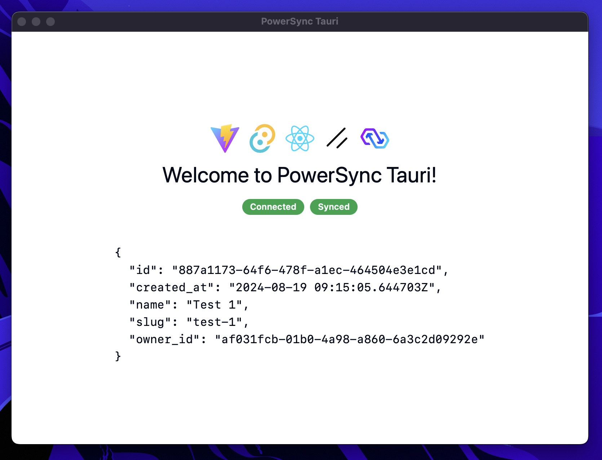

# Tauri + Shadcn UI + PowerSync

> [!NOTE]
> This template now uses the [official PowerSync Tauri SDK](https://releases.powersync.com/announcements/introducing-the-powersync-tauri-sdk-alpha) (`@powersync/tauri-plugin`), replacing the previous WASM-based workaround. This brings native SQLite performance, reliable data persistence across app updates, and cross-window sync support. The backend connector now lives in Rust — see `src-tauri/src/main.rs`.

This template should help get you started developing with [Vite](https://vitejs.dev), [Tauri](https://tauri.app), [React](https://reactjs.org), [Typescript](https://typescriptlang.org), [Shadcn UI](https://ui.shadcn.com), and [PowerSync](https://powersync.com).

[PowerSync](https://powersync.com) is a sync layer for building local-first apps with simple state management and real-time reactivity.

The architecture is based on practices suggested by [@alan2207](https://github.com/alan2207) in his [bulletproof-react](https://github.com/alan2207/bulletproof-react/blob/master/docs/project-structure.md).

[**Version without PowerSync**](https://github.com/MrLightful/create-tauri-core).



## Getting Started

### Basics

#### Tauri

Ensure that you have the [Tauri prerequisites](https://tauri.app/v1/guides/getting-started/prerequisites) installed.

#### Install dependencies

```bash
bun install
```

#### Start the development server

```bash
bun tauri dev
```

### PowerSync setup

This template is set up to work with PowerSync. PowerSync is a sync layer for building local-first apps with simple state management and real-time reactivity.

Ensure that the PowerSync prerequisites are met: [Configure your source database](https://docs.powersync.com/usage/installation/database-setup) and [Connect PowerSync to your database](https://docs.powersync.com/usage/installation/database-connection).

#### Environment variables

Copy the `.env.example` file to `.env` and fill in the required environment variables.

```bash
cp .env.example .env
```

Set `VITE_POWERSYNC_URL` and `VITE_POWERSYNC_TOKEN` to your PowerSync server URL and [development token](https://docs.powersync.com/usage/installation/authentication-setup/development-tokens) respectively.

#### Define your PowerSync schema

Define your PowerSync schema in the [`src/features/providers/AppSchema.ts`](src/hooks/powersync/app-schema.ts) file. The default schema there is an arbitrary Project schema for `projects` table. You can replace it with your own.

For more information, see [PowerSync documentation](https://docs.powersync.com/client-sdk-references/js-web#id-1.-define-the-schema).

## Using a Different Package Manager

This project uses [bun](https://bun.sh) by default. To use a different package manager (npm, pnpm, yarn, etc.), update the following:

1. **`src-tauri/tauri.conf.json`** — Replace the `beforeDevCommand` and `beforeBuildCommand`:
   ```jsonc
   // For npm/yarn/pnpm:
   "beforeDevCommand": "<pm> run dev",
   "beforeBuildCommand": "<pm> run build",
   ```
2. **`.husky/pre-commit`** — Replace `bunx` with your package manager's equivalent:
   ```sh
   npx lint-staged        # npm
   pnpm dlx lint-staged   # pnpm
   yarn dlx lint-staged   # yarn
   ```
3. **`package.json`** — Update the `lint-staged` command:
   ```jsonc
   "lint-staged": {
     "*.{js,jsx,ts,tsx,json,jsonc,css,scss,md,mdx}": [
       "npx ultracite fix"        // npm
       // "pnpm dlx ultracite fix" // pnpm
       // "yarn dlx ultracite fix" // yarn
     ]
   }
   ```
4. Delete `bun.lock` and run your package manager's install command to generate a new lock file.

## What's included

### Core

A basic Tauri setup with Vite, React, Typescript.

#### Tailwind CSS

A basic Tailwind CSS setup. Includes a `components.json` for Shadcn UI components.

## How to use?

Once again, the architecture of the template is based on practices proposed by [@alan2207](https://github.com/alan2207) in his [bulletproof-react](https://github.com/alan2207/bulletproof-react/blob/master/docs/project-structure.md).

```
src
|
+-- app               # application layer containing:
|   |                 # this folder might differ based on the meta framework used
|   +-- routes        # application routes / can also be pages
|   +-- app.tsx       # main application component
|   +-- provider.tsx  # application provider that wraps the entire application with different global providers - this might also differ based on meta framework used
|   +-- router.tsx    # application router configuration
+-- assets            # assets folder can contain all the static files such as images, fonts, etc.
|
+-- components        # shared components used across the entire application
|
+-- config            # global configurations, exported env variables etc.
|
+-- features          # feature based modules
|
+-- hooks             # shared hooks used across the entire application
|
+-- lib               # reusable libraries preconfigured for the application
|
+-- stores            # global state stores
|
+-- testing           # test utilities and mocks
|
+-- types             # shared types used across the application
|
+-- utils             # shared utility functions
```

```
src/features/awesome-feature
|
+-- api         # exported API request declarations and api hooks related to a specific feature
|
+-- assets      # assets folder can contain all the static files for a specific feature
|
+-- components  # components scoped to a specific feature
|
+-- hooks       # hooks scoped to a specific feature
|
+-- stores      # state stores for a specific feature
|
+-- types       # typescript types used within the feature
|
+-- utils       # utility functions for a specific feature
```

So, simply put:

- Define your app's routes in `src/app/router.tsx` and `src/app/routes/*` with minimal business logic.
- The pages from the routes should be using `src/features` to build up functionality on the page.
- The features should be using components from `src/components`, which are pure ui components (like [Shadcn UI](https://ui.shadcn.com/)) or layouts.
